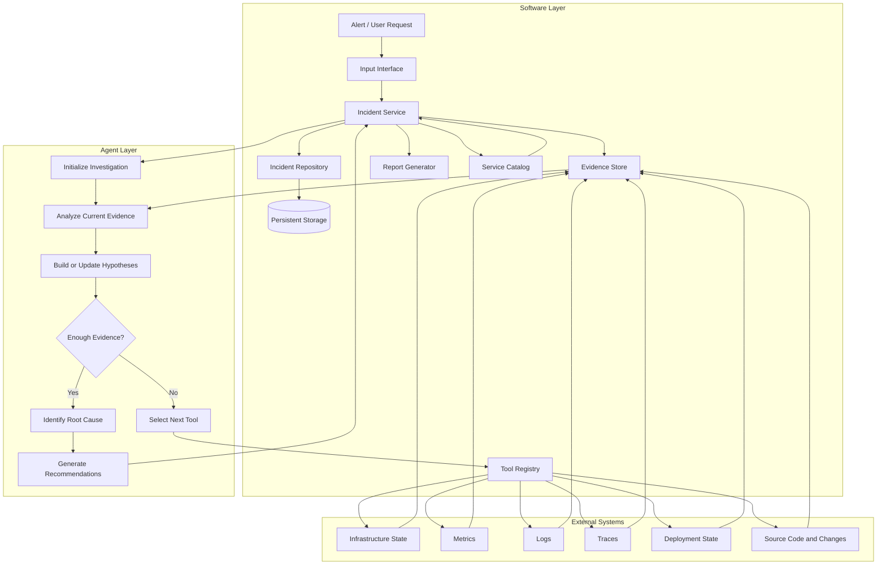

# AriOps Architecture

AriOps uses a modular architecture that separates platform responsibilities, investigation reasoning, and external integrations.

The Software Layer manages requests, incidents, evidence, tools, persistence, and reports. The Agent Layer analyzes available evidence, maintains investigation hypotheses, and produces root cause findings and recommendations. External systems provide infrastructure and observability data through controlled tool integrations.

> This diagram represents the target architecture and will evolve as the project develops.

The agent does not directly access infrastructure or persistent storage. External access is performed through controlled tools, while incident state and evidence remain managed by the Software Layer.
