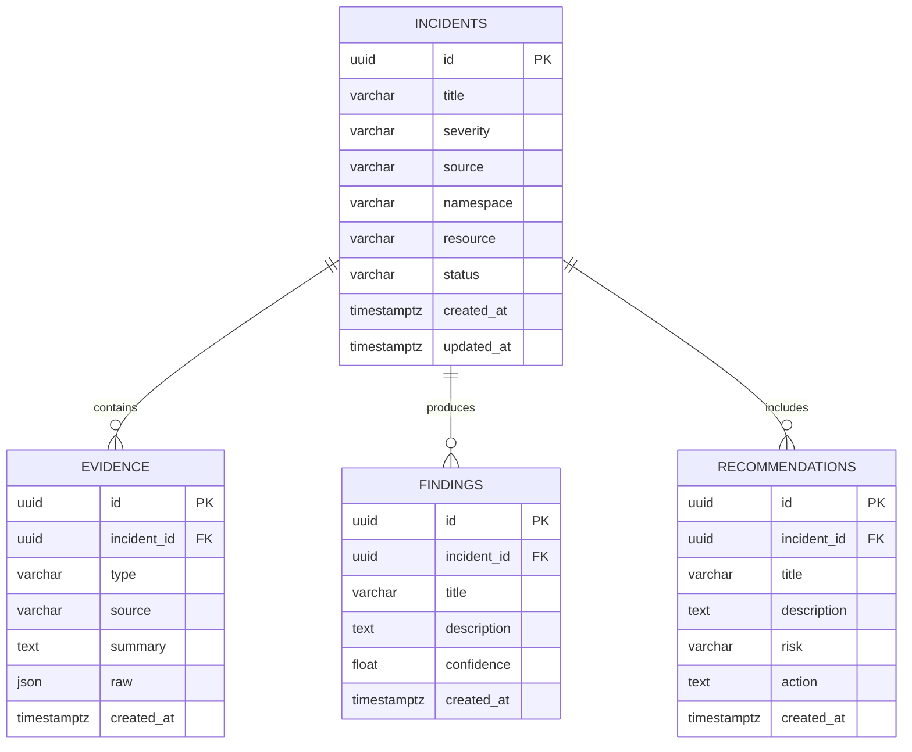

# AriOps Database ERD

The initial PostgreSQL schema persists investigation records. An incident is the
aggregate root; it can have many evidence items, findings, and recommendations.

`incident_id` is a foreign key to `incidents.id` in each child table. The
database also contains Alembic's internal `alembic_version` table, which tracks
applied schema migrations and is not part of the application data model.
