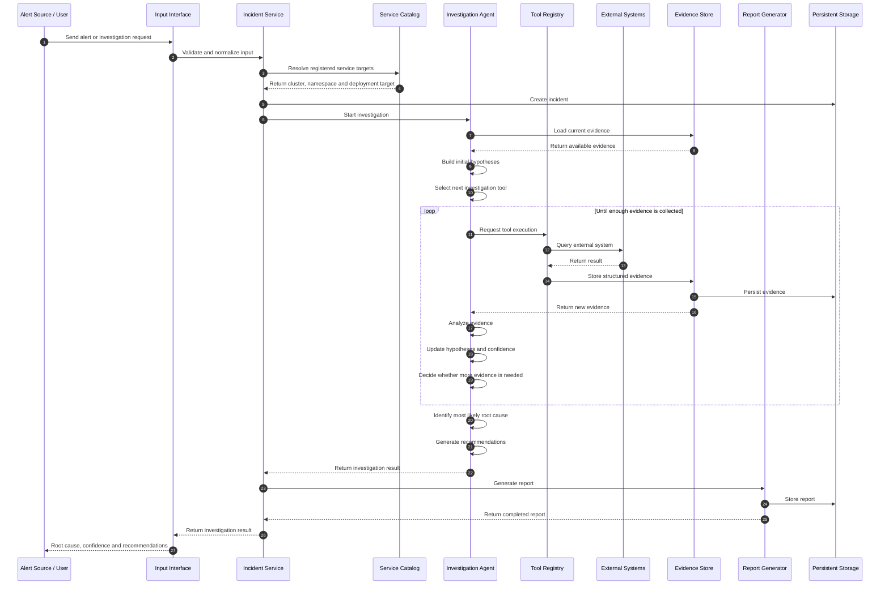

# Investigation Flow

An investigation begins when AriOps receives an alert or a manual request.

The platform creates an incident and starts the investigation workflow. The agent analyzes the available context, creates possible hypotheses, and requests additional evidence through controlled tools when necessary. The process continues until enough evidence is available to produce a root cause and recommendations.

> This diagram represents the target investigation flow and will evolve as the project develops.

The initial AriOps scope focuses on investigation and recommendation. Automated remediation is outside the initial MVP.
